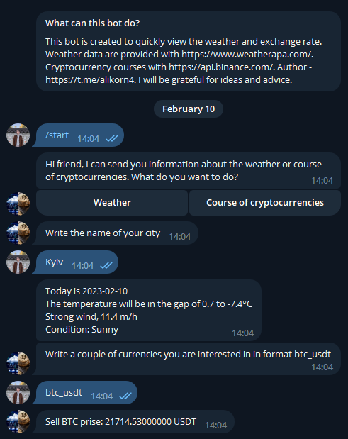

# CryptoWeather telegram bot
Telegram bot, in which you can find out the weather today in the city user and the current cryptocurrency course.
The weather data is taken from https://www.weatherapi.com/, data on the course https://api.binance.com/.

## Installing / Getting started
Python3 must be already installed!
You need to get a token for telegram bot ([instruction](https://medium.com/geekculture/generate-telegram-token-for-bot-api-d26faf9bf064))
Place the token in the auth_data.py file

```shell
git clone https://github.com/yaroslav-demchenko/crypto_weather_bot
cd kitchen-service
python3 -m venv venv
venv\Scripts\activate (on Windows)
source venv/bin/activate (on macOS)
pip install -r requirements.txt
```
run main.py (Shift + F10)

## Demo
